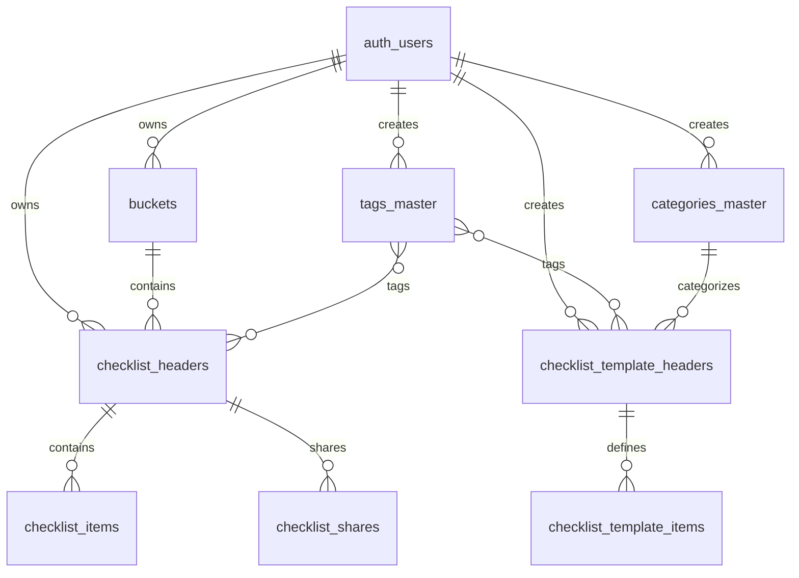

# Database Setup Guide

This document provides a comprehensive overview of the CheckList App database schema, including all tables, relationships, constraints, and setup instructions.

## Overview

The CheckList App uses **Supabase (PostgreSQL)** as its backend database with the following key features:
- **Row Level Security (RLS)** for data isolation
- **UUID-based primary keys** for all entities
- **Foreign key constraints** to maintain data integrity
- **Trigger-based user management** for automatic profile creation
- **Comprehensive indexes** for optimal query performance

## Quick Setup

### 1. Create Supabase Project
1. Go to [supabase.com](https://supabase.com) and create a new project
2. Note your project URL and anon key for environment variables

### 2. Enable Extensions
Run this SQL in your Supabase SQL Editor:
```sql
-- Enable UUID generation
CREATE EXTENSION IF NOT EXISTS "uuid-ossp";

-- Enable additional extensions if needed
CREATE EXTENSION IF NOT EXISTS "pg_trgm";  -- For text search
```

### 3. Run Database Schema
Execute the complete schema from [`supabase-schema.sql`](./supabase-schema.sql) in your Supabase SQL Editor.

### 4. Set Environment Variables
```env
EXPO_PUBLIC_SUPABASE_URL=https://your-project.supabase.co
EXPO_PUBLIC_SUPABASE_ANON_KEY=your-anon-key
```

## Database Schema

### Core Tables Overview

| Table | Purpose | Key Features |
|-------|---------|-------------|
| `auth.users` | User authentication | Managed by Supabase Auth |
| `buckets` | Folder organization | User-specific folders |
| `tags_master` | Global tag system | Reusable tags across users |
| `categories_master` | Template categories | For organizing templates |
| `checklist_headers` | Checklist metadata | Main checklist data |
| `checklist_items` | Checklist items | Individual tasks |
| `checklist_shares` | Sharing system | Share checklists with others |
| `checklist_template_headers` | Template metadata | Reusable templates |
| `checklist_template_items` | Template items | Template task definitions |

## Table Definitions

### Users Table (`auth.users`)
**Managed by Supabase Auth** - No custom table needed.

**Key Columns:**
- `id` (UUID, Primary Key): User identifier
- `email` (String): User email address
- `created_at` (Timestamp): Account creation date
- `email_confirmed_at` (Timestamp): Email verification date

### Buckets Table
**Purpose:** Store user-specific folders for organizing checklists.

```sql
CREATE TABLE buckets (
    bucket_id UUID PRIMARY KEY DEFAULT uuid_generate_v4(),
    user_id UUID REFERENCES auth.users(id) ON DELETE CASCADE,
    bucket_name VARCHAR(50) NOT NULL CHECK (length(bucket_name) >= 1),
    created_at TIMESTAMPTZ DEFAULT now(),
    updated_at TIMESTAMPTZ DEFAULT now(),
    
    CONSTRAINT unique_bucket_per_user UNIQUE (user_id, bucket_name)
);
```

**Key Features:**
- Maximum 50 buckets per user (enforced by policy)
- Bucket names must be 1-50 characters
- Unique bucket names per user
- Automatic timestamps

**Example Data:**
```
bucket_id                            | user_id  | bucket_name | created_at
uuid_123                            | user_abc | Shopping    | 2025-01-10 10:00:00
uuid_456                            | user_abc | Work        | 2025-01-10 10:05:00
```

### Tags Master Table
**Purpose:** Global tag system for labeling checklists and templates.

```sql
CREATE TABLE tags_master (
    tag_id UUID PRIMARY KEY DEFAULT uuid_generate_v4(),
    user_id UUID REFERENCES auth.users(id) ON DELETE CASCADE,
    name VARCHAR(30) NOT NULL CHECK (length(name) >= 1),
    created_at TIMESTAMPTZ DEFAULT now(),
    
    CONSTRAINT unique_tag_per_user UNIQUE (user_id, name)
);
```

**Key Features:**
- Maximum 100 tags per user (enforced by policy)
- Tag names must be 1-30 characters
- Unique tag names per user
- User-scoped tags for privacy

**Example Data:**
```
tag_id   | user_id  | name    | created_at
uuid_789 | user_abc | urgent  | 2025-01-10 11:00:00
uuid_012 | user_abc | work    | 2025-01-10 11:05:00
```

### Categories Master Table
**Purpose:** Categories for organizing templates.

```sql
CREATE TABLE categories_master (
    category_id UUID PRIMARY KEY DEFAULT uuid_generate_v4(),
    user_id UUID REFERENCES auth.users(id) ON DELETE CASCADE,
    name VARCHAR(50) NOT NULL CHECK (length(name) >= 1),
    created_at TIMESTAMPTZ DEFAULT now(),
    
    CONSTRAINT unique_category_per_user UNIQUE (user_id, name)
);
```

**Key Features:**
- User-specific categories
- Category names must be 1-50 characters
- Unique category names per user

**Example Data:**
```
category_id | user_id  | name      | created_at
uuid_345    | user_abc | Personal  | 2025-01-10 12:00:00
uuid_678    | user_abc | Work      | 2025-01-10 12:05:00
```

### Checklist Headers Table
**Purpose:** Store checklist metadata and configuration.

```sql
CREATE TABLE checklist_headers (
    checklist_id UUID PRIMARY KEY DEFAULT uuid_generate_v4(),
    user_id UUID NOT NULL REFERENCES auth.users(id) ON DELETE CASCADE,
    name VARCHAR(100) NOT NULL CHECK (length(name) >= 1),
    target_date DATE,
    bucket_id UUID REFERENCES buckets(bucket_id) ON DELETE SET NULL,
    tags UUID[] DEFAULT '{}',
    created_at TIMESTAMPTZ DEFAULT now(),
    updated_at TIMESTAMPTZ DEFAULT now()
);
```

**Key Features:**
- Checklist names must be 1-100 characters
- Optional target date for deadline tracking
- Optional bucket assignment for organization
- Array of tag UUIDs (maximum 10 tags per checklist)
- Automatic timestamp management

**Constraints:**
- Maximum 10 tags per checklist (enforced by policy)
- All tags must exist in `tags_master` table

**Example Data:**
```
checklist_id | user_id  | name         | target_date | bucket_id | tags            | created_at
uuid_901     | user_abc | Grocery List | 2025-01-15  | uuid_123  | {uuid_789}      | 2025-01-10 13:00:00
uuid_234     | user_abc | Work Tasks   | NULL        | uuid_456  | {uuid_012}      | 2025-01-10 13:30:00
```

### Checklist Items Table
**Purpose:** Store individual tasks within checklists.

```sql
CREATE TABLE checklist_items (
    item_id UUID PRIMARY KEY DEFAULT uuid_generate_v4(),
    checklist_id UUID NOT NULL REFERENCES checklist_headers(checklist_id) ON DELETE CASCADE,
    text VARCHAR(500) NOT NULL CHECK (length(text) >= 1),
    due_date DATE,
    status VARCHAR(20) DEFAULT 'pending' CHECK (status IN ('pending', 'completed', 'in_progress', 'canceled')),
    due_days INTEGER,
    notes TEXT,
    created_at TIMESTAMPTZ DEFAULT now(),
    updated_at TIMESTAMPTZ DEFAULT now()
);
```

**Key Features:**
- Item text must be 1-500 characters
- Four status types: pending, completed, in_progress, canceled
- Optional due date and notes
- Due days calculated relative to checklist target date
- Maximum 100 items per checklist (enforced by policy)

**Example Data:**
```
item_id  | checklist_id | text      | due_date   | status    | due_days | notes           | created_at
uuid_567 | uuid_901     | Buy milk  | 2025-01-14 | pending   | -1       | Get 2% milk     | 2025-01-10 13:05:00
uuid_890 | uuid_901     | Buy bread | 2025-01-15 | completed | 0        | Whole grain     | 2025-01-10 13:06:00
```

### Checklist Shares Table
**Purpose:** Manage sharing checklists with other users.

```sql
CREATE TABLE checklist_shares (
    share_id UUID PRIMARY KEY DEFAULT uuid_generate_v4(),
    checklist_id UUID NOT NULL REFERENCES checklist_headers(checklist_id) ON DELETE CASCADE,
    shared_with_user_id UUID REFERENCES auth.users(id) ON DELETE CASCADE,
    share_token VARCHAR(255) UNIQUE,
    permission VARCHAR(10) DEFAULT 'view' CHECK (permission IN ('view', 'edit')),
    created_at TIMESTAMPTZ DEFAULT now()
);
```

**Key Features:**
- Share with specific users or via public tokens
- Two permission levels: view and edit
- Unique share tokens for URL-based access
- Automatic cleanup when checklist or user is deleted

**Example Data:**
```
share_id | checklist_id | shared_with_user_id | share_token | permission | created_at
uuid_123 | uuid_901     | user_def           | NULL        | edit       | 2025-01-10 14:00:00
uuid_456 | uuid_901     | NULL               | abc123xyz   | view       | 2025-01-10 14:05:00
```

### Checklist Template Headers Table
**Purpose:** Store reusable checklist templates.

```sql
CREATE TABLE checklist_template_headers (
    template_id UUID PRIMARY KEY DEFAULT uuid_generate_v4(),
    user_id UUID NOT NULL REFERENCES auth.users(id) ON DELETE CASCADE,
    name VARCHAR(100) NOT NULL CHECK (length(name) >= 1),
    category_id UUID REFERENCES categories_master(category_id) ON DELETE SET NULL,
    tags UUID[] DEFAULT '{}',
    created_at TIMESTAMPTZ DEFAULT now(),
    updated_at TIMESTAMPTZ DEFAULT now()
);
```

**Key Features:**
- Template names must be 1-100 characters
- Optional category assignment
- Array of tag UUIDs (maximum 10 tags per template)
- User-owned templates

**Example Data:**
```
template_id | user_id  | name             | category_id | tags       | created_at
uuid_789    | user_abc | Weekly Shopping  | uuid_345    | {uuid_789} | 2025-01-10 15:00:00
uuid_012    | user_abc | Daily Standup    | uuid_678    | {uuid_012} | 2025-01-10 15:30:00
```

### Checklist Template Items Table
**Purpose:** Store template task definitions.

```sql
CREATE TABLE checklist_template_items (
    item_id UUID PRIMARY KEY DEFAULT uuid_generate_v4(),
    template_id UUID NOT NULL REFERENCES checklist_template_headers(template_id) ON DELETE CASCADE,
    text VARCHAR(500) NOT NULL CHECK (length(text) >= 1),
    status VARCHAR(20) DEFAULT 'pending' CHECK (status IN ('pending', 'completed', 'in_progress', 'canceled')),
    due_days INTEGER,
    notes TEXT
);
```

**Key Features:**
- Same constraints as checklist items
- Due days relative to template instantiation
- Default status for new items

**Example Data:**
```
item_id  | template_id | text         | status  | due_days | notes
uuid_345 | uuid_789    | Buy produce  | pending | -2       | Check for sales
uuid_678 | uuid_789    | Buy dairy    | pending | -1       | Milk, cheese, yogurt
```

## Relationships and Constraints

### Primary Relationships



### Key Constraints

1. **User Data Isolation**
   - All user data is isolated via RLS policies
   - Foreign key references to `auth.users(id)`

2. **Data Limits**
   - Maximum 50 buckets per user
   - Maximum 100 tags per user
   - Maximum 10 tags per checklist/template
   - Maximum 100 items per checklist

3. **Data Integrity**
   - Cascade deletion for user-owned data
   - Set NULL for optional references
   - Check constraints for text lengths and enums

## Row Level Security (RLS) Policies

All tables have RLS enabled with user-specific policies:

### Example Policy (Buckets)
```sql
-- Enable RLS
ALTER TABLE buckets ENABLE ROW LEVEL SECURITY;

-- Users can only access their own buckets
CREATE POLICY user_buckets_policy ON buckets
FOR ALL USING (user_id = auth.uid());
```

### Policy Summary

| Table | Policy | Description |
|-------|--------|-------------|
| `buckets` | `user_buckets_policy` | Users access only their buckets |
| `tags_master` | `user_tags_policy` | Users access only their tags |
| `categories_master` | `user_categories_policy` | Users access only their categories |
| `checklist_headers` | `user_checklists_policy` | Users access only their checklists |
| `checklist_items` | `user_checklist_items_policy` | Users access items of their checklists |
| `checklist_shares` | `shared_checklists_policy` | Users access shared checklists |
| `checklist_template_headers` | `user_templates_policy` | Users access only their templates |
| `checklist_template_items` | `user_template_items_policy` | Users access items of their templates |

## Indexes for Performance

```sql
-- User-based lookups
CREATE INDEX idx_buckets_user_id ON buckets(user_id);
CREATE INDEX idx_tags_master_user_id ON tags_master(user_id);
CREATE INDEX idx_categories_master_user_id ON categories_master(user_id);
CREATE INDEX idx_checklist_headers_user_id ON checklist_headers(user_id);
CREATE INDEX idx_checklist_template_headers_user_id ON checklist_template_headers(user_id);

-- Relationship lookups
CREATE INDEX idx_checklist_headers_bucket_id ON checklist_headers(bucket_id);
CREATE INDEX idx_checklist_items_checklist_id ON checklist_items(checklist_id);
CREATE INDEX idx_checklist_template_items_template_id ON checklist_template_items(template_id);
CREATE INDEX idx_checklist_shares_checklist_id ON checklist_shares(checklist_id);

-- Date-based queries
CREATE INDEX idx_checklist_headers_target_date ON checklist_headers(target_date);
CREATE INDEX idx_checklist_headers_created_at ON checklist_headers(created_at);
CREATE INDEX idx_checklist_headers_updated_at ON checklist_headers(updated_at);
CREATE INDEX idx_checklist_items_due_date ON checklist_items(due_date);

-- Status-based queries
CREATE INDEX idx_checklist_items_status ON checklist_items(status);

-- Tag array searches (GIN index)
CREATE INDEX idx_checklist_headers_tags ON checklist_headers USING GIN(tags);
CREATE INDEX idx_checklist_template_headers_tags ON checklist_template_headers USING GIN(tags);

-- Text search (for future search functionality)
CREATE INDEX idx_checklist_headers_name_trgm ON checklist_headers USING gin(name gin_trgm_ops);
CREATE INDEX idx_checklist_items_text_trgm ON checklist_items USING gin(text gin_trgm_ops);
```

## Triggers and Functions

### Auto-Update Timestamps
```sql
-- Function to update updated_at timestamp
CREATE OR REPLACE FUNCTION update_updated_at_column()
RETURNS TRIGGER AS $$
BEGIN
    NEW.updated_at = now();
    RETURN NEW;
END;
$$ language 'plpgsql';

-- Apply to relevant tables
CREATE TRIGGER update_buckets_updated_at
    BEFORE UPDATE ON buckets
    FOR EACH ROW EXECUTE FUNCTION update_updated_at_column();

CREATE TRIGGER update_checklist_headers_updated_at
    BEFORE UPDATE ON checklist_headers
    FOR EACH ROW EXECUTE FUNCTION update_updated_at_column();

CREATE TRIGGER update_checklist_items_updated_at
    BEFORE UPDATE ON checklist_items
    FOR EACH ROW EXECUTE FUNCTION update_updated_at_column();

CREATE TRIGGER update_checklist_template_headers_updated_at
    BEFORE UPDATE ON checklist_template_headers
    FOR EACH ROW EXECUTE FUNCTION update_updated_at_column();
```

### User Profile Management
```sql
-- Function to handle new user registration
CREATE OR REPLACE FUNCTION handle_new_user()
RETURNS TRIGGER AS $$
BEGIN
    -- Any additional user setup logic can go here
    -- For now, we just log the new user creation
    RETURN NEW;
END;
$$ language 'plpgsql';

-- Trigger for new user creation
CREATE TRIGGER on_auth_user_created
    AFTER INSERT ON auth.users
    FOR EACH ROW EXECUTE FUNCTION handle_new_user();
```

## Data Validation

### Application-Level Validation
The app includes comprehensive validation through `lib/validations.ts`:
- **Text length validation** with character counts
- **Tag count limits** (max 10 per checklist)
- **Item count limits** (max 100 per checklist)
- **Bucket count limits** (max 50 per user)
- **Required field validation**

### Database-Level Validation
- **Check constraints** for text lengths and enums
- **Foreign key constraints** for data integrity
- **Unique constraints** for preventing duplicates
- **Not null constraints** for required fields

## Common Queries

### Get User's Checklists with Grouping
```sql
-- Get checklists grouped by bucket
SELECT 
    ch.checklist_id,
    ch.name,
    ch.target_date,
    ch.created_at,
    ch.updated_at,
    b.bucket_name,
    COALESCE(b.bucket_name, 'No Folder') as group_name
FROM checklist_headers ch
LEFT JOIN buckets b ON ch.bucket_id = b.bucket_id
WHERE ch.user_id = $1
ORDER BY 
    CASE WHEN b.bucket_name IS NULL THEN 1 ELSE 0 END,
    b.bucket_name,
    ch.created_at DESC;
```

### Get Checklist with Items and Progress
```sql
-- Get checklist with completion stats
SELECT 
    ch.*,
    COUNT(ci.item_id) as total_items,
    COUNT(CASE WHEN ci.status = 'completed' THEN 1 END) as completed_items,
    ROUND(
        COUNT(CASE WHEN ci.status = 'completed' THEN 1 END) * 100.0 / 
        NULLIF(COUNT(ci.item_id), 0), 
        0
    ) as completion_percentage
FROM checklist_headers ch
LEFT JOIN checklist_items ci ON ch.checklist_id = ci.checklist_id
WHERE ch.checklist_id = $1
GROUP BY ch.checklist_id;
```

### Get User's Tags with Usage Count
```sql
-- Get tags with usage statistics
SELECT 
    tm.tag_id,
    tm.name,
    COUNT(ch.checklist_id) as usage_count
FROM tags_master tm
LEFT JOIN checklist_headers ch ON tm.tag_id = ANY(ch.tags)
WHERE tm.user_id = $1
GROUP BY tm.tag_id, tm.name
ORDER BY usage_count DESC, tm.name;
```

## Backup and Maintenance

### Regular Maintenance Tasks
1. **Vacuum and Analyze** tables periodically
2. **Monitor index usage** and optimize as needed
3. **Archive old data** if needed
4. **Monitor storage usage** in Supabase dashboard

### Backup Strategy
Supabase provides automatic backups, but consider:
1. **Export critical data** regularly
2. **Test restoration procedures**
3. **Document recovery processes**

## Troubleshooting

### Common Issues

1. **RLS Policy Errors**
   - Ensure user is authenticated
   - Check policy conditions match query context

2. **Foreign Key Violations**
   - Verify referenced records exist
   - Check cascade deletion settings

3. **Performance Issues**
   - Review query execution plans
   - Ensure proper indexes exist
   - Consider query optimization

### Debugging Queries
```sql
-- Check RLS policies
SELECT schemaname, tablename, policyname, permissive, roles, cmd, qual, with_check
FROM pg_policies
WHERE schemaname = 'public';

-- Check table constraints
SELECT conname, contype, conkey, confkey, consrc
FROM pg_constraint
WHERE conrelid = 'public.checklist_headers'::regclass;

-- Analyze query performance
EXPLAIN ANALYZE
SELECT * FROM checklist_headers
WHERE user_id = 'user-uuid'
ORDER BY created_at DESC;
```

---

This database setup provides a robust, scalable foundation for the CheckList App with proper data isolation, integrity constraints, and performance optimization.
